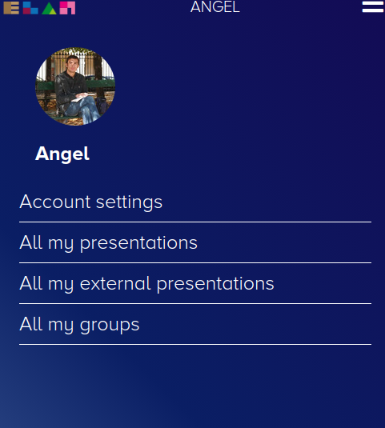
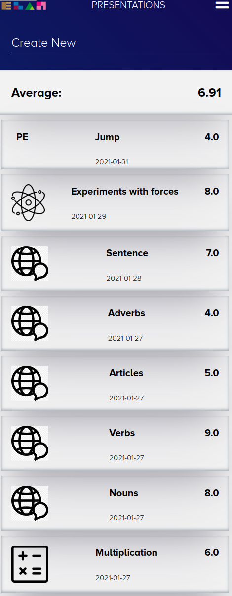
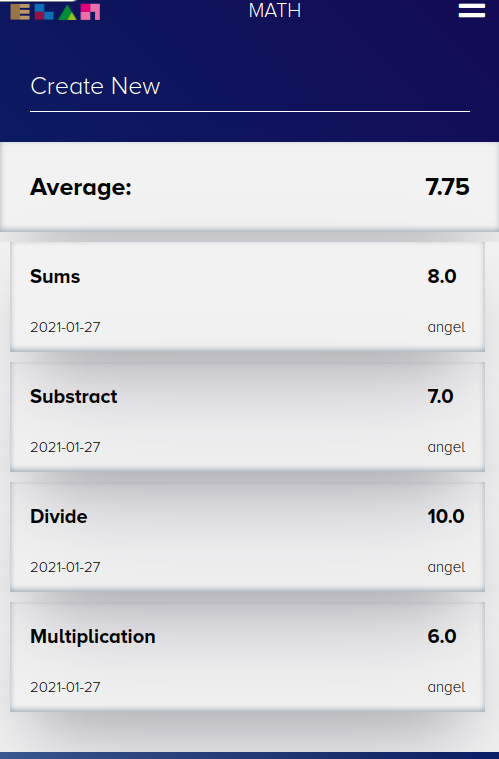

# Rails Programming

## PROJECT: Elan Manager

## Introduction

This is a web application to keep track of your school scores grouped by subject.
You can create as many subjects as you want and start to save there all your scores.

We used different concepts of Ruby on Rails including:

- Models, Views, and Controllers (MVC)
- Data Structures & Relationships
- Routing
- Migrations
- View
- RESTful design
- Authentication system with Devise
- Active Storage
- TDD
- Heroku deployment
- Adding gems for extra features

## To install and run

- Clone the project repo from [GitHub](https://github.com/Zappat0n/elan_manager_app) using `git clone https://github.com/Zappat0n/elan_manager_app`
- Make sure [Ruby-lang](https://www.ruby-lang.org/en/) is installed
- Make sure [Bundler](https://bundler.io/) is installed
- Install the required gems. Run `bundle install`
- Install the locale database. Run `rails db:migrate`
- If you have problems with the gem versions try installing [RVM](https://rvm.io/)
- Launch a Rails Server using `rails server`
- Open your browser and go to `127.0.0.1:3000` or `localhost:3000`

## Live version

  [Heroku](https://pacific-cliffs-52385.herokuapp.com/)

## Elan manager app

In the main menu you will see the following options:
- Account settings: Here you will be able to update your picture and your account name.

- All my presentations: To see your exercises that belong to one group with its score.

- All my external presentations: To see all the exercises that do not belong to any group.

- All my groups: Here you cand see all your subjects and create new ones. You can also select a group and see all the exercises for that group and the average score.

Inside the presentations and groups page you can create new presentations and groups with its own picture.

## Designed With

- Ruby
- Rails
- Git
- Gitflows
- Rubocop
- Styleint
- VS Code
- Devise
- Bootstrap

## Contribute to this Project

Contributions, issues, and feature requests are welcome! Start by:

  - Forking the project
  - Cloning the project to your local machine
  - cd into the project directory
  - Run git checkout -b your-branch-name
  - Make your contributions
  - Push your branch up to your forked repository
  - Open a Pull Request with a detailed description of the development branch of the original project for a review

## Authors

👤 **Angel Barros**

- GitHub: [@Zappat0n](https://github.com/Zappat0n)
- LinkedIn: [LinkedIn](https://www.linkedin.com/in/angel-barros/)

## Show your support

Give a ⭐️ if you like this project!
